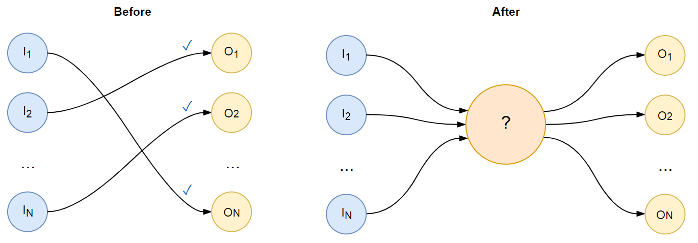
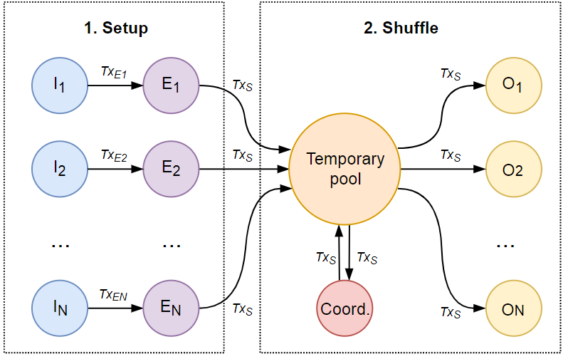

# Chaumian Shuffle on Stellar™  

*by [H_M_X_](https://www.reddit.com/user/H_M_X_), 01-Sep-2018*

## Introduction

It has been stated over and over again that there are many legitimate reasons for privacy in the cryptocurrency space and online in general. I don't necessarily subscribe to all of those arguments, though I do find some particularly compelling. Personally, I think the optimal balance between the individual's rights and greater good still remains to be found, and is indeed a dynamic and evolving variable<sup>[1](#fn1)</sup>. Nevertheless, in this manuscript I describe a novel protocol to anonymously shuffle the native XLM asset on the [Stellar](www.stellar.org) network. 

Main features of the proposed protocol:

* The shuffling is done in a completely [Chaumian](https://bitcointalk.org/index.php?topic=279249.0) fashion, meaning that privacy is assured and there is no need for a trusted 3<sup>rd</sup> party to exist. In fact, a non-trusted 3<sup>rd</sup> party coordinator is included in this proposal to assist the practical implementation, but the protocol can be made slightly more elaborate to not require such assistance. 
* The actual shuffling transaction is completely atomic and there is no way for a malicious participant(s) to steal funds or to leave them locked forever in the temporary account.

* The protocol allows each anonymous participant to detect potential adversarial intentions of any other member or the coordinator, in which case the attempted shuffle is abandoned and funds are safely reclaimed by their original owners.

- - -

## TL;DR



**Before:**  The Stellar network operates a distributed public ledger and uses the Stellar Consensus Protocol to achieve decentralized agreement about the order of transactions. As such, every successful transaction stays forever embedded in the ledger's transparent history. There is no easy<sup>[2](#fn2)</sup> way to anonymously transfer funds from one account to another.

**After:** In contrast, the Chaumian Shuffle allows *k = N* participants to "blend" their funds into a single account, from which the payment operations are subsequently made. All operations are batched in a single transaction for security. For an outsider, it is now impossible to learn, from the public ledger at least, which receiving account is connected with which sending account (*k*-anonymity), unless the amounts transferred allow reconstruction of some of the links (Coin Sudoku). To prevent this all participant should agree on the same amount to be transferred.

**How it can be done?** With Stellar smart contracts, of course. There exists a specific sequence of transactions, outlined below, which allows this to be achieved without additional communication. Relying only on the Stellar network makes the Chaumian Shuffle on Stellar completely decentralized.

**When can I use it?** I am seriously considering implementing the protocol in a web application. However, my schedule does not currently permit any optimistic prediction. Help would be appreciated.

## Smart contract implementation



The Chaumian Shuffle on Stellar can be implemented as a sequence of [transactions](https://www.stellar.org/developers/guides/concepts/transactions.html) composed of multiple [operations](https://www.stellar.org/developers/guides/concepts/operations.html). The version presented herein employs the assistance of a coordinator whose main role is to make the scheme symmetric with respect to the collaborating parties as well as being an extra signer for transactions. Additionally, the coordinator is involve prior to the shuffle where he facilitates the formation of groups by monitoring the Stellar ledger for parties seeking to join a shuffle.

The protocol is split into two main phases called [Setup](#Setup) and [Shuffle](#Shuffle). In the following description some details<sup>[3](#fn3)</sup> are omitted for simplicity. (*2021 note: I intended to work out the details during the actual implementation, but I never got to do it*)

### <a name="Setup">Setup</a>

The Setup phase is composed of two steps, 1. escrow creation and 2. anonymous permutation generation to generate the list of outputs of the shuffle transaction.

**1. Escrow creation**

As first step, each participant *I<sub>i</sub>*, signals his desire to participate in the shuffle by locking a predefined amount of his funds into a newly created escrow account *E<sub>i</sub>* where the coordinator *C* has been added as an additional signer. By doing this the member locks his funds for certain time period, e.g. 3 days, and is therefore considered sincere in his intention. Two signatures are required to move funds from *E<sub>i</sub>*, namely those of *I<sub>i</sub>* and *C*. If the shuffle is for any reason abandoned, the participant can utilize a special [pre-authorized](https://www.stellar.org/developers/guides/concepts/multi-sig.html#pre-authorized-transaction) transaction, `TxReclaim`, which allows him to reclaim the funds after a certain time period by merging *E<sub>i</sub>* back into *I<sub>i</sub>*.

```
A) Transaction: TxCreate                             # TODO: include required fee reserve
     Source account:  Ii
     Sequence number: m + 1
   Operations:
     1. Create Ei with initial ballance of 3.1 XLM 
---------------------------------------------------------------------
B) Transaction: TxReclaim                            # pre-authorized, not submitted!
     Source account:  Ei
     Sequence number: n + 2
     Timebounds: Valid starting 3 days from now
   Operations:
     1. Merge Ei into Ii
---------------------------------------------------------------------
C) Transaction: TxSignatures
     Source account: Ei
     Sequence number: n + 1
   Operations:
     1. Add hash(TxReclaim) as a signer
     2. Add Ii as a signer with weight 1
     3. Add C as a signer with weight 1
     4. Set all thresholds to 2
     5. Set the weight of Ei to 0
---------------------------------------------------------------------
D) Transaction: TxFund
     Source account: Ii
     Sequence number: m + 2
   Operations:
     1. Pay a predefined amount, e.g 1000, of XLM to Ei
```

Here it is assumed that the initial sequence numbers of *I<sub>i</sub>* and *E<sub>i</sub>* are *m* and *n*, respectively. Note that only transactions `TxCreate`, `TxSignatures`, and `TxFund` are submitted. The pre-authorized transaction `TxReclaim` is kept safe by each participant as insurance.

**2. Anonymous permutation generation**

The next step is to somehow collectively construct the list of receiving accounts *O<sub>i</sub>* without compromising the anonymity of participants. The *verifiable anonymous shuffling* technique was invented by [Brickell and Shmatikov](https://www.cs.cornell.edu/~shmat/shmat_kdd06.pdf) in 2006 by building upon the concept of Mix Networks, which were initially introduced by Chaum, and later developed as [Onion Routing](https://www.onion-router.net/Publications/JSAC-1998.pdf) (e.g.  [Tor](https://www.torproject.org/)). Further upgrades were implemented in the [DISSENT](http://dedis.cs.yale.edu/dissent/papers/ccs10/dissent.pdf) protocol.

In this manuscript the procedure is a simplified version of the [previously published one](http://dedis.cs.yale.edu/dissent/pres/121015-jf-oxford.pdf) due to the fact that signature verification is automatically done by the underlying Stellar network. The input accounts *I<sub>i</sub>* , *i ∈ {1, ..., N}* are also assumed to be ordered alphanumerically, *I<sub>1</sub> < I<sub>2</sub><...<I<sub>N</sub>* to simplify notation. Moreover, it is assumed *O<sub>i</sub>* is the intended receiving account for *I<sub>i</sub>*. 

The anonymous generation of the permutation can be decomposed into three sub-steps. Below these sub-steps are loosely described using pseudo-code.

```
A) Generate encryption keys
  For i = 1 to N, participant Ii
    generates inner encryption keypair (pi, qi)
    generates outer encryption keypair (ri, si)
    broadcasts public encryption keys pi and ri
```

```
B) Onion Encryption
  For i = 1 to N, participant Ii
    sequentially encrypts Oi with inner keys pN, ..., p1 to create O'i
    sequentially encrypts O'i with outer keys rN, ..., r1 to create O''i
    broadcasts the final result O''i
```

For better understanding of the onion encryption step below an example is shown for *N* = 3. In the below notation  "(*m*)p" means "encrypt message *m* with public key *p*".

```
      O''1 = ((( (((O1)p3)p2)p1 )r3)r2)r1
      O''2 = ((( (((O2)p3)p2)p1 )r3)r2)r1
      O''3 = ((( (((O3)p3)p2)p1 )r3)r2)r1
```

```
C) Anonymization
  Participat I1
    takes all O''i, decrypts using p1, and broadcasts the list

  For i = 2 to N, participant Ii
    decrypts and randomly permutes all items in the list by using qi
    and broadcasts the result
  
  For i = 1 to N, participant Ii
    checks that O'i is in the permuted list
    signals "Go" or "No-Go".
  
  If any Ii signalled "No-Go" Then Abort

  For i = 1 to N, participant Ii
    broadcasts secret key qi
   
  For i = 1 to N, participant Ii
    decrypts the list using all broadcasted q1, ... qN
```

Note that after the last for loop all participants will have constructed the same list.

Turning all the steps into a concrete implementation depends also on whether the intent is to have all communication happen on the Stellar network, or some other systems can be used for communicating. 

Stellar transactions allow communication between accounts by using protocols such as [Interstellar Whisper](https://hmatejx.github.io/Interstellar-Whisper/) or by utilizing the [Managa Data](https://www.stellar.org/developers/guides/concepts/list-of-operations.html#manage-data) operation with the obvious curve25519 encryption. Moreover in the practical implementation also the asymmetric encryption should be specified, for example [RSA-OAEP](https://github.com/diafygi/webcrypto-examples/#rsa-oaep) using keys of suitable length (e.g. 2048+). And if absolute purity is not mandatory, a system of using [IPFS](https://ipfs.io)  and exchanging only hashes on Stellar is simpler and cheaper (less transaction fees).

### <a name="Shuffle">Shuffle</a>

The atomic Shuffle transaction is presented in it's full glory below.

```
#TODO: elaborate

Op1 { Coordinator C creates the temporary account T} +
Op2...OpN+1 { adds all I1, ..., IN as signers } +
OpN+2...Op2N+1 { pay 100 XLM to C } +
Op2N+2...Op3N+1 { pay 100 XLM to Oi } +
Op3N+2 { Merge T  to C}
```

https://cosmic.link/

## (Post-festum) Note about prior art

After developing the idea from scratch and almost finalizing this manuscript, I have scanned the internet for prior art and actual crypto algorithm needed for a practical implementation (yes, I know I should have done it the other way around...). 

While doing this I have stumbled upon a quite similar idea already proposed for the Ripple network called [PathShuffle](https://www.cs.purdue.edu/homes/pmorenos/public/pathshuffle.pdf) by the same excellent team that developed [CoinShuffle](http://crypsys.mmci.uni-saarland.de/projects/CoinShuffle/) and [CoinShuffle++](https://crypsys.mmci.uni-saarland.de/projects/FastDC/paper.pdf). Moreover, this team found a much more efficient solution to anonymous shared permutation generation building upon the Dining Cryptographer approach called [DiceMix](https://eprint.iacr.org/2016/824.pdf). The similarity of my proposal and PathShuffle warrants a comparison. 

In my opinion, the proposed Chaumian shuffle on Stellar does hold some subjective and practical improvements over prior art:

- The PathShuffle implementation is originally intended for shuffling non-native assets on the Ripple network. However in appendix A the authors also provide a protocol for the case of the native XRP asset.

- A cursory look at subsection A.2 Protocol Overview reveals that due to the lack of multi-operation  transactions on Ripple the entire scheme is very elaborate. 

- A cleverly defined set of transactions and backup reclaim transactions has to be signed and distributed by all users prior to executing them on the network in a certain sequence. The approach also requires two temporary accounts and a custom distributed threshold signature scheme. 

- In contrast, the ability to [batch](https://www.stellar.org/developers/guides/concepts/operations.html) operations in a single transaction makes the final shuffle transaction on Stellar completely atomic.

- Last but not least, locking the funds for a certain time period in an escrow accounts *E<sub>i</sub>* prior to the shuffle allows for (some) level of pre-selection of sincere participants and hopefully limits adversary behavior.

___

<a name="fn1">1)</a> I have neither read not reflected on this enough to have a strong opinion on this topic.

<a name="fn2">2)</a> It is possible to do it via a trusted 3rd party in the obvious way, but that obviously requires trust and represents a major point of weakness.

<a name="fn3">3)</a> Details on auxiliary considerations, such as formation of the group, agreeing on the amount of funds to be transferred, timing, etc. may be further described in a subsequent manuscript, but more realistically directly in the source code of the implementation.